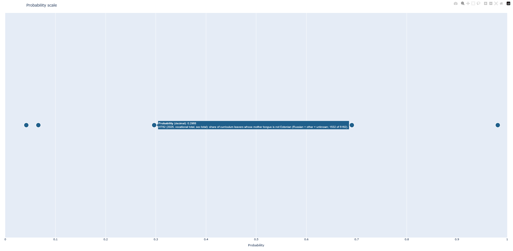

# Probability scale task

## Author

**Name:** Magnar Markvart  
**Occupation:** Web Developer  
**Note:** Data work is cool, but still pretty new to me :)

## What this is

At first glance data analytics felt daunting—nobody spelled out exactly what to do. **If you are reviewing this repo, it is meant as a roadmap from idea to a small finished artifact:** a **single horizontal “scale”** where different real-world numbers are shown as **values between 0 and 1** (shares, rates, or reasoned estimates), so you can compare how “big” one story is next to another. It isn’t meant as a formal decision model.

**Idea:** The chart holds **six** markers on the 0–1 line, built from **five** Statistics Estonia PxWeb flows—[RL21801](https://andmed.stat.ee/) contributes **two** related probabilities (nationality + dwelling), the others one each. You can add more points later if you want a fuller scale.

## Example output

Static snapshot of the interactive Plotly chart (hover for full labels):



After setup, run `python build_scale.py` to regenerate **`output/probability_scale_<year>.html`** (open in a browser) and the CSV for the same run.

## The six scale points

| # | Source | What the x-position approximates |
|---|--------|-----------------------------------|
| 1 | **NH21** | Share unemployed among women 15–74 in the labour force (official rate → 0–1). |
| 2 | **PA101** | Estimated share of employees earning **above** the national **mean** gross wage (decile interpolation). |
| 3 | **HT309** | Share of students in Estonia (by **citizenship**) from **outside Europe** (continental subtotals only). |
| 4 | **HT62** | Share of vocational **dropouts** whose **mother tongue** is not Estonian. |
| 5 | **RL21801** | Share of the **2021** population grid recorded as **ethnic Estonian** (“rahvus”; not citizenship). |
| 6 | **RL21801** | Share living in **conventional housing** (*tavaeluruum*) among the dwelling “total” bucket. |

Details, API shapes, and caveats: **`docs/source_*.md`** (one file per source family).

## How it runs (short)

1. **`build_scale.py`** calls `probability_scale.data.compote.build_scale_table()` and merges every source into one table (`probability`, `event_label`, etc.).
2. Each fetcher lives under `src/probability_scale/data/` (NH21, PA101, HT309, HT62, RL21801).
3. **Plotly** writes the HTML; **CSV** is for inspection. **Network** is required for API calls.

## Setup

```bash
python -m venv .venv
.\.venv\Scripts\activate
pip install -r requirements.txt
pip install -e .
```

`pip install -e .` is required because the package lives under **`src/probability_scale/`** (standard `src` layout).

## Run

```bash
python build_scale.py
```

Fresh outputs: `output/probability_scale_<year>.html` and `output/scale_table_<year>.csv` (year comes from the merged table). The committed **`output/example-scale-item.png`** is a reference still image for reviewers.

## Docs

- **`docs/source_*.md`** — per-source methodology and PxWeb notes.
- **Code** — module docstrings at package and main function level; non-obvious logic (e.g. PA101 deciles, HT309 regions) is explained there or in those docs.

## Repo layout

`src/probability_scale/data/` — fetch + compute; `plotting/` — chart; `build_scale.py` — entrypoint; `pyproject.toml` + `requirements.txt` — packaging and deps.

## License

Released under the **MIT License** — see [`LICENSE`](./LICENSE).
